# Introduction

In this lab, we will be running Debezium on a remote EC2 instance to
capture changes from a MySQL instance hosted on Amazon Relational
Database Service (RDS). In addition, we will be streaming changes in
near real-time and storing them in S3. You will see streaming and cloud
storage services used in tandem to bring cloud data into a data lake.

We will continue to use a GitHub Codespace to automate infrastructure
deployment and interact with cloud resources.

# Pre-requisites

You should have a Codespace environment up and running **in your
browser** with the following git repository cloned and open:
https://github.com/UST-SEIS-745-DLE-Labs/lab-02-streaming-cdc-kafka-debezium.

Additionally, you should be familiar with the infrastructure as code and
lab conventions we have used previously in class. When running the lab
you will be interactively copying lines from bash scripts and pasting
them into your bash terminal. Pay attention to the code you are
executing and the output as you learn how to automate infrastructure
deployment in AWS.

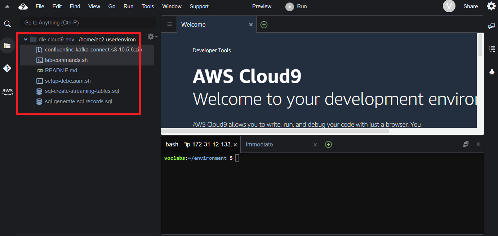

# Section 1: Set environment variables and create an S3 bucket (or reuse an existing one)

1)  Once you have opened your Codespace and cloned the repository, it
    should look something like this:

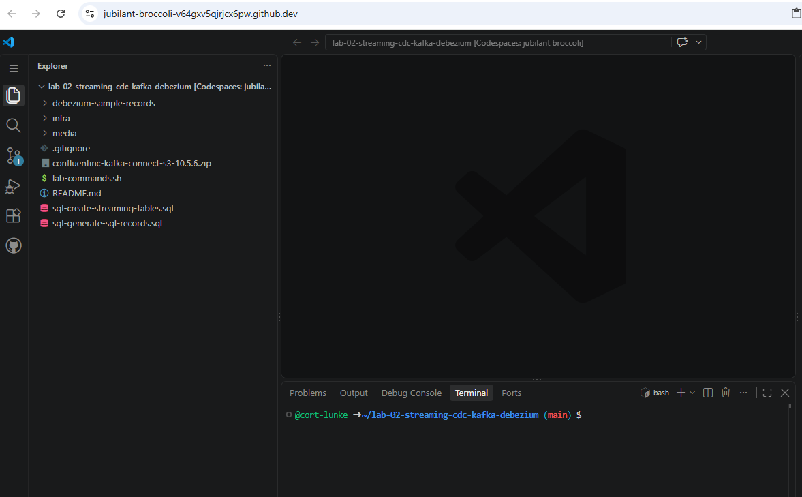

2)  First, open infra/lab-params.sh You need to update the CLIENT_IP
    variable with your IP address shown at
    <https://checkip.amazonaws.com/>. Don't forget to save lab-params.sh
    after updating the variable (Ctrl+S on Windows)

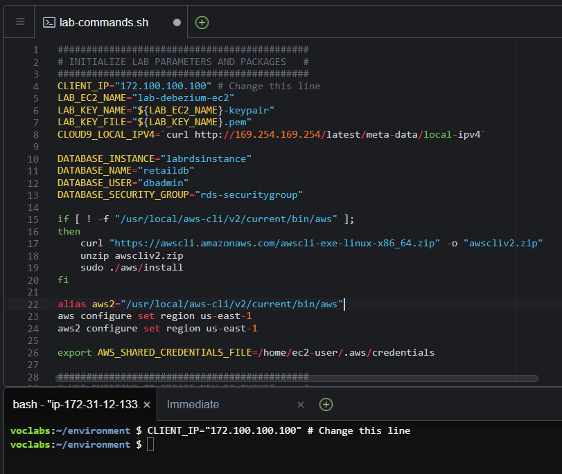

3)  Next, run codespace-init.sh to install lab dependencies and the
    AWS CLI. While it does not hurt to install the AWS CLI a second
    time, if you have previously installed the AWS CLI in this
    environment you may simply run the first and last executable lines
    (sudo apt and aws configure).

> Just like Lab 1, you will need to get your AWS access key id, secret
> access key, and session token from your AWS Academy environment.
>
> 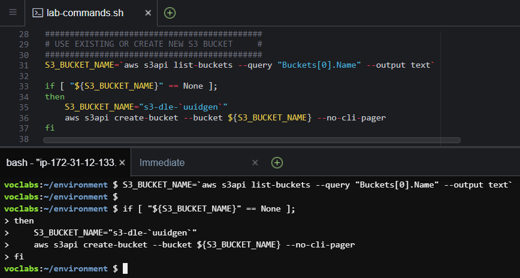
>
> 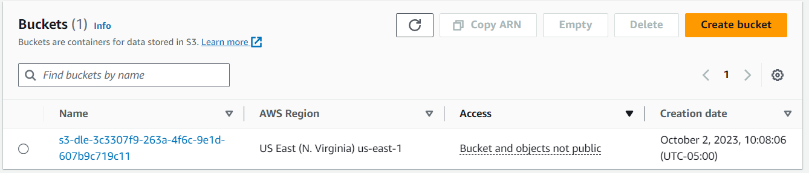

4)  Now that you have configured the AWS CLI and set necessary lab
    variables, we can start deploying resources. Open env-init.sh to
    start deploying lab infrastructure. The following lines of code
    initialize lab parameters, queries for an existing S3 bucket using
    the AWS CLI, and creates a new S3 bucket if one does not yet exist.

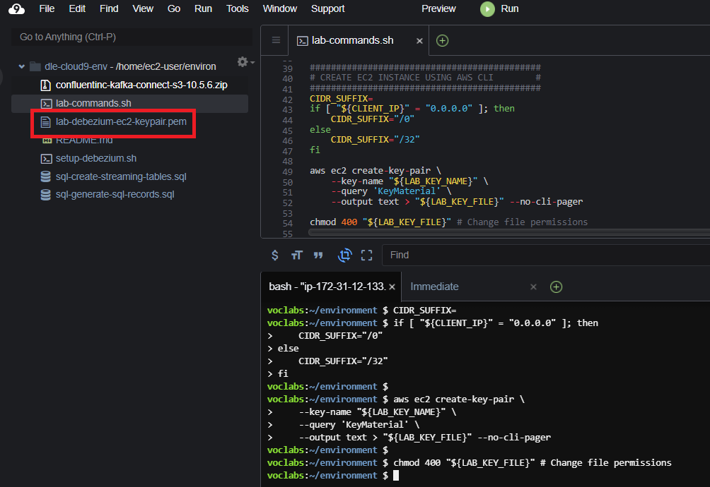

5)  You may double check that your bucket was created at
    <https://s3.console.aws.amazon.com/s3>:

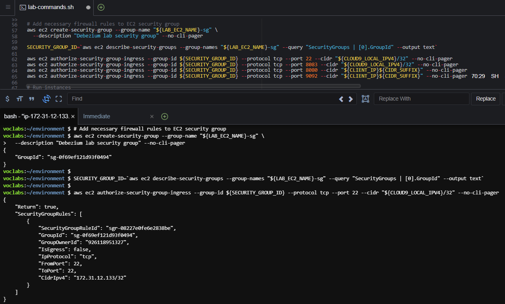

# Section 2: Deploy an Amazon EC2 Instance for hosting Debezium

1)  The next step in env-init.sh deploys an EC2
    instance leveraging the AWS CLI. Run this section of code to turn
    your client IP address into a proper CIDR range, create a keypair
    for authentication, create a security group and corresponding
    firewall rules, and run the instance:

    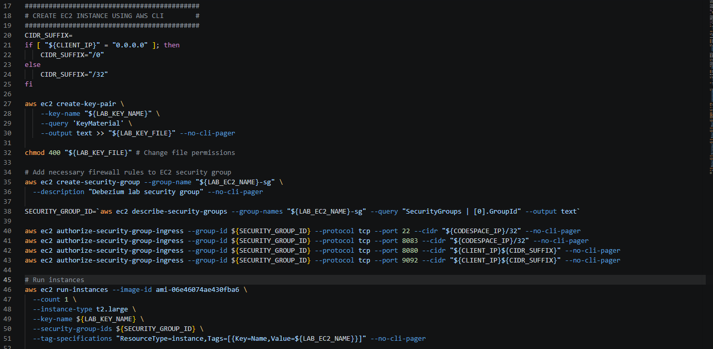

2)  This next section queries instance attributes and assigns them to variables. This includes the instance
    id, public domain name, and local IP address for your EC2 instance.
    It also associates the instance with the security profile
    LabInstanceProfile provided by Vocareum. We will use this to
    facilitate connectivity with the instance and interoperability with
    other AWS resources later in the lab.

    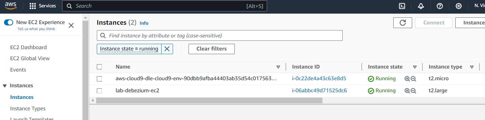

3)  Make sure the EC2 instance is running and review the configuration in the
    AWS console at <https://us-east-1.console.aws.amazon.com/ec2/>:

    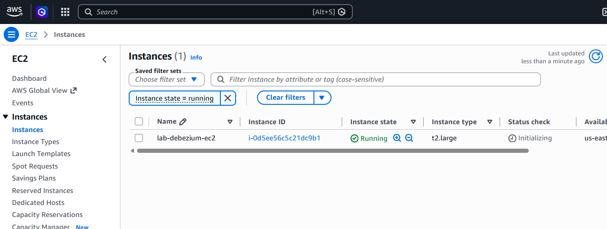

# Section 3: Create a cloud MySQL database hosted on RDS and initialize data, streaming tables

1)  In the first two sections, we made sure to deploy a cloud storage
    instance on S3 and a cloud virtual machine on EC2 for hosting
    streaming services. Next, we are going to deploy a SQL Database
    leveraging Amazon's PaaS Relational Database Service (RDS). For this
    lab we will be leveraging MySQL as the database provider and our
    data source.

2)  First, create a new security group
    specifically for secure database access. This will allow your
    Codespace instance, streaming environment on EC2, and PC to access
    MySQL on port 3306:

    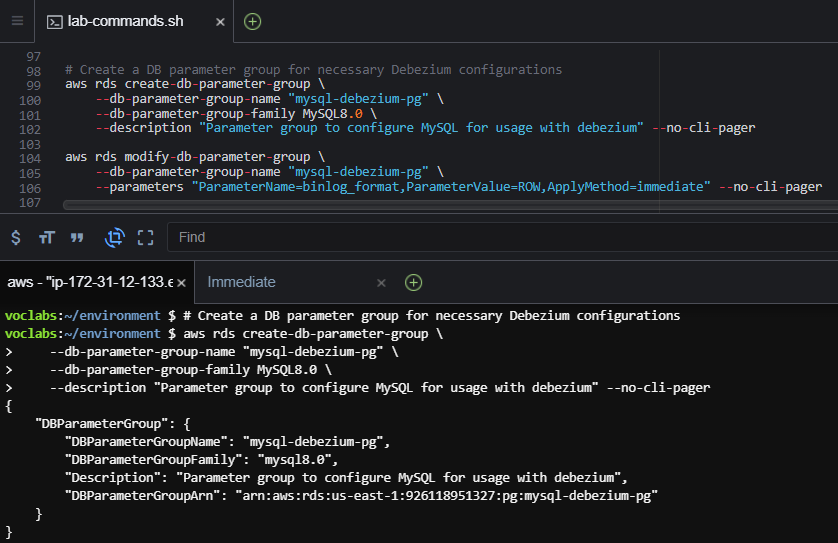

3)  The Debezium MySQL connector is dependent on the binary log to
    capture changes. This section of code creates a database parameter
    group which overrides some of the MySQL defaults for compatibility
    with Debezium:

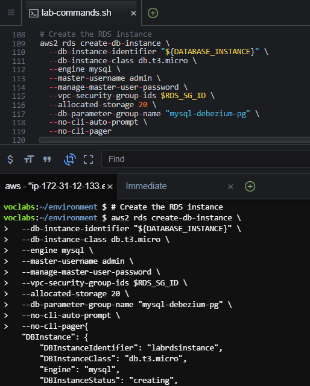

4)  Create the RDS instance, associating
    both the security group and parameter group with the new MySQL
    database. Note that the aws rds wait command will block until the
    database is available. It is necessary to wait before moving on to
    the next steps. It takes potentially 5-10 minutes to spin up the RDS
    instance.

    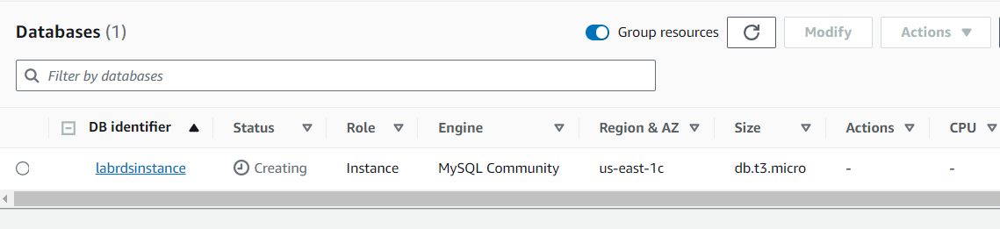

5)  Open the RDS console and view your new
    database instance by clicking 'databases' at
    <https://us-east-1.console.aws.amazon.com/rds>:

    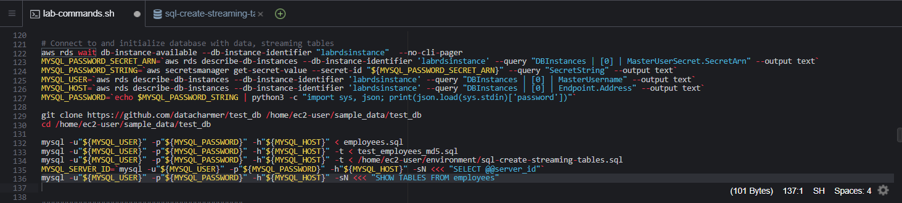

6)  We are leveraging the MySQL employees database to populate sample
    data and explore streaming data collection. This database is
    documented here: <https://dev.mysql.com/doc/employee/en/>. The
    following section of code downloads the database initialization
    artifacts from Git. Note that when you use the MySQL command line
    interface, you are connecting from Cloud9 to your remote RDS
    instance hosted by Amazon.

**Database initialization:**

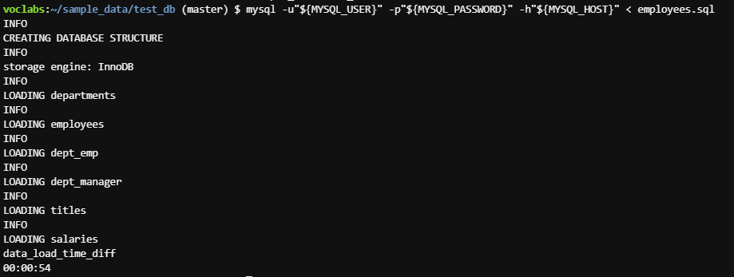

**Database output:**

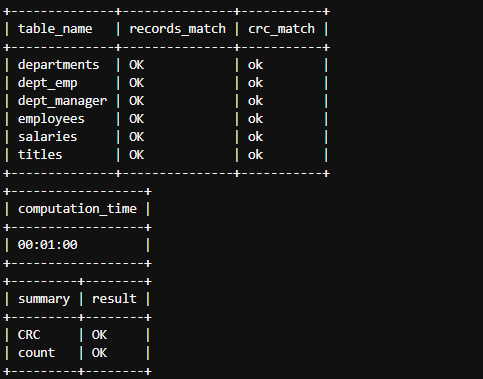

**Database tests:**

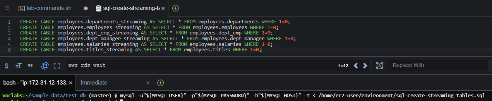

7)  Rather than stream directly from base tables, we want to avoid an
    overly large initial load (Debezium snapshot load) from these
    tables. Instead, we are creating empty copies of these tables and
    populating them with a subset of data to better manage load on our
    lab environment. We will insert, update, and delete records later in
    the lab once streaming services are up and running.

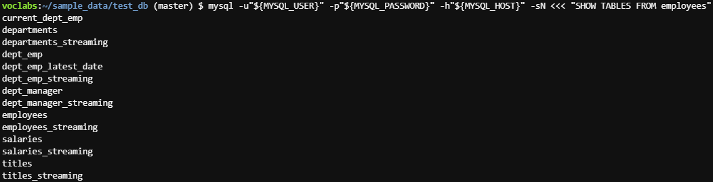

8)  Validate tables leveraging the SHOW TABLES command:

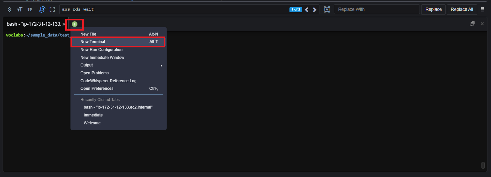

# Section 4: Start Debezium services and load Confluent S3 sink connector

1.  Run the following section of code to copy files and open an SSH
    session with your running EC2 instance created in section 2. Note
    that we are copying the Confluent S3 connector (zip file) so that we
    can install it on our Kafka Connect instance later:

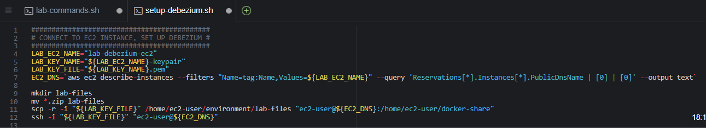

> **ASCII art welcomes you to the Amazon Linux instance:**

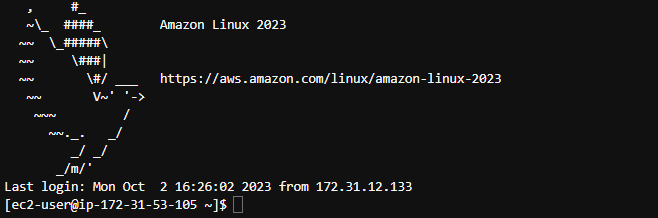

1)  You will be using docker to run different services on this machine:
    Zookeeper, Kafka (brokers), Kafka Connect with Debezium/Confluent
    connectors, and Debezium UI (currently expiremental). Run the
    following section of code to install and configure Docker and
    prepare the Confluent connector for installation on Kafka Connect:

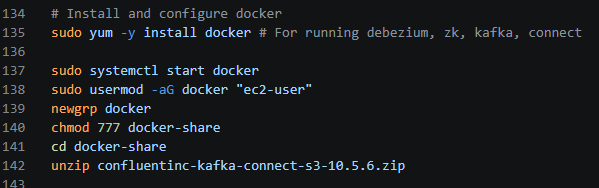

2)  As discussed in class, Kafka may rely on Zookeeper for cluster
    configuration management and consumer-partition offsets. Zookeeper
    needs to be up and running before we start Kafka. Note that we are
    leveraging the Debezium docker image to run Zookeeper, Kafka,
    Connect, and Debezium services. Query the logs until you see the
    following output indicating that Zookeeper is up and ready to take
    requests.

> 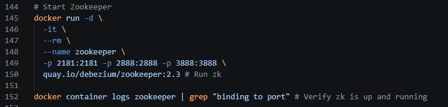

**Zookeeper running and ready to take
requests:**

3)  Now that Zookeeper is up and running, we can start Kafka. Note the
    docker link, ensuring that the Kafka container can access services
    running on the Zookeeper container. The link feature may be
    deprecated in a future Docker release, but is still used by these
    Debezium containers.

**Starting Kafka:**

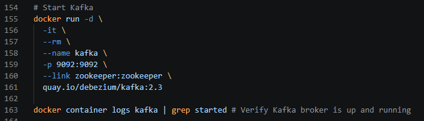

**Kafka running and ready to take
requests:**

4)  Similarly, we are now ready to start Kafka Connect. Note the volume
    mapping which places the extracted Confluent S3 sink connector in
    the plugins directory on Debezium, allowing us to integrate with S3.
    Additionally, there is a link to enable the dependency between Kafka
    Connect and Kafka.

**Starting Kafka Connect:**
> 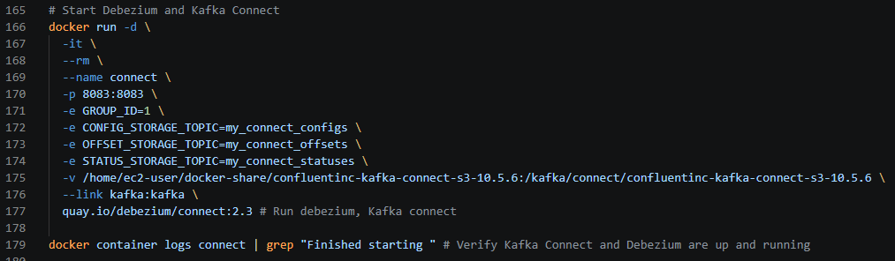
>
**Kafka Connect running and ready to
> take requests:**

> 

5)  Finally, start Debezium UI. We will take a brief look at this
    service to validate our Debezium connector in the next section. Once
    you have started Debezium UI, you should switch back to your first
    terminal session in Cloud9.

**Starting Debezium UI:**

(./media/image29.png)

6)  List Kafka topics. Now that all of our Kafka and Debezium-related
    service are up and running on our EC2 instance, exit twice to return
    control back to your GitHub Codespace machine. You should see the
    shell user change from ec2-user to your GitHub account name.
    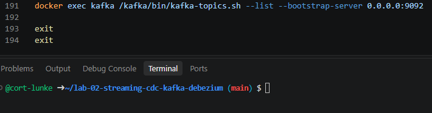

# Section 5: Deploy and validate a MySQL source connector and an S3 sink connector on Kafka Connect

1)  Time to open and run lab-commands.sh. In this
    section, we will be deploying connectors to Kafka Connect leveraging
    its REST API. Make sure you have exited the EC2 instance and you see
    your GitHub account name in the terminal.

    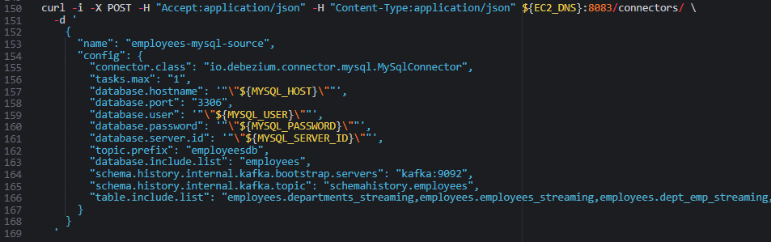

2)  Leverage curl to invoke the Kafka Connect REST API and create our
    source connector. Note that we are passing important database
    details including the host, user, and password. Additionally, we
    specify the databases and tables to include, as well as the location
    of our Kafka servers (among other configs).
**JSON request to create MySQL source
connector:**

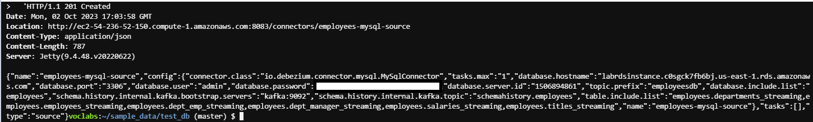

**API response:** 

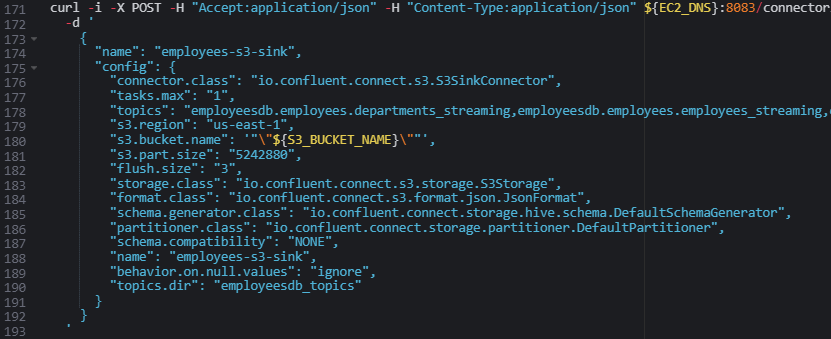

3)  Next, we'll start the sink connector to stream data from Kafka
    topics to AWS S3. Note that we are setting S3 details, the Confluent
    connector class, storage format for database events, topics for
    monitoring, the path to output in S3, and behavior for null values
    to capture delete events (among other configs).
**JSON request to create S3 sink
connector:**

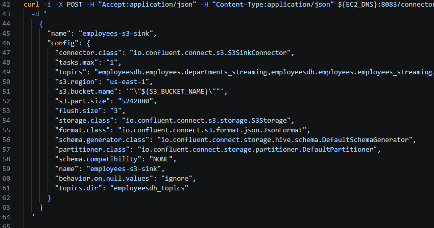

**API response:**

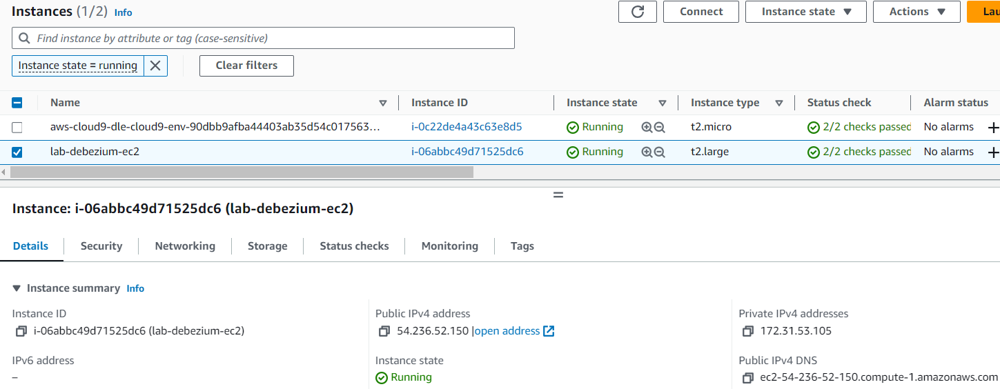

4)  Next, navigate to Debezium via the URL printed to your terminal. If
    you remembered to update and save lab-params.sh with your
    appropriate IP address then you will be able to access it fine. If
    you forgot, you may add a new firewall rule manually in the AWS
    console.

**Debezium URL:\**

**Debezium UI:**
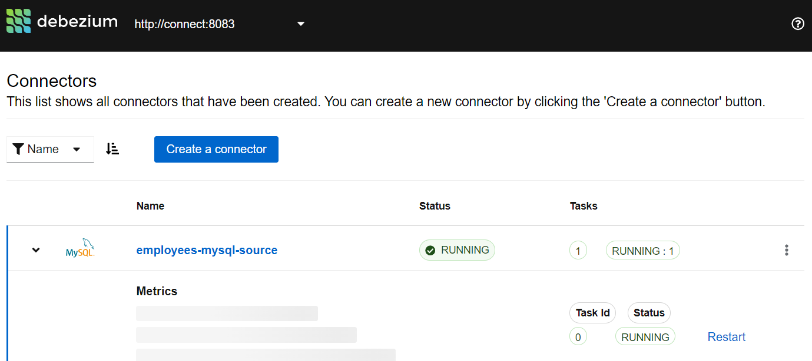

5)  The Debezium UI only shows the status of connectors and tasks for
    Debezium connectors at this time. We can leverage the API to check
    the status of both the MySQL source and S3 sink connectors.

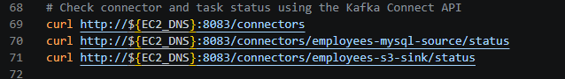

# Section 6: Validate create, update, delete, and read (snapshot) operations in MySQL and Debezium

1)  In this section, we will be performing create, update, and delete
    operations within our source database. If previous sections have
    been completed correctly, you should see events flowing from your
    SQL database all the way to your cloud storage in S3.

2)  Connect to your RDS instance using the MySQL command line interface.
    Input commands from sql-generate-sql-records.sql, starting with
    insert commands.

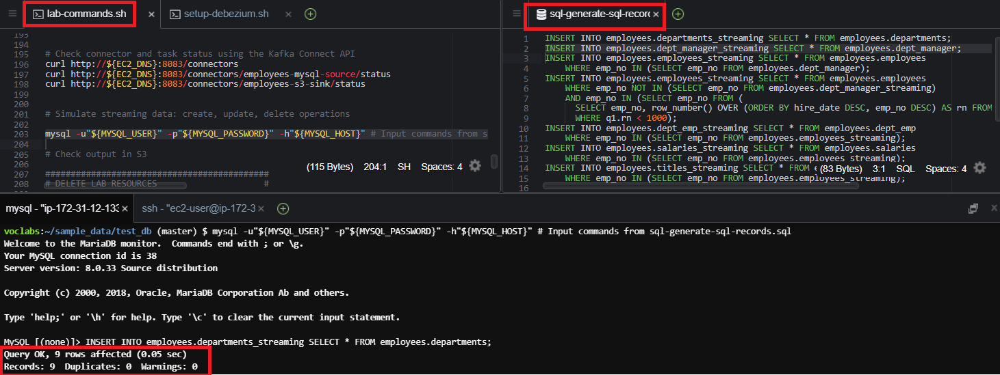

3)  Once all insert commands have completed, inspect the create events
    being stored in your S3 bucket at
    <https://s3.console.aws.amazon.com/s3>. Leverage the console to
    inspect, download, and view insert events. Note that the "before"
    state of the row is null for a create, while the "after" state will
    have the values for the new row. Inspect the other metadata
    associated with the new row including table name, database, log
    file, etc.

**Browsing your S3 bucket:**

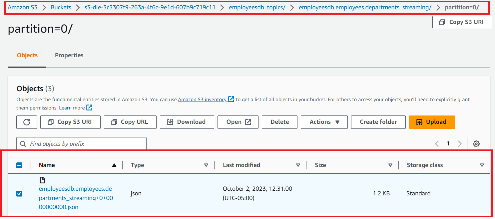

**Viewing insert event details:**

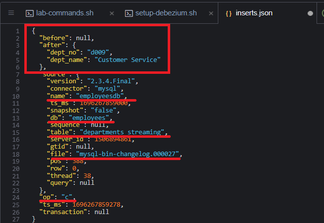

4)  Next, generate some update events. Business is good and we are
    giving managers a raise, increasing their salary by 10%. Note that
    this is for demo purposes only and we will not be leveraging
    from_date or to_date, but doing in-place updates on the
    salaries_streaming table:

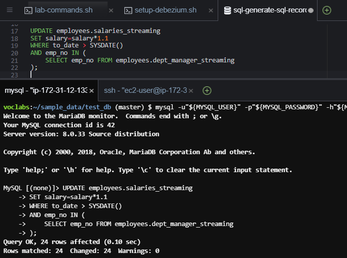

5)  Inspect the update events being stored in S3, taking note of the
    before/after state of the row and salary increase:

> 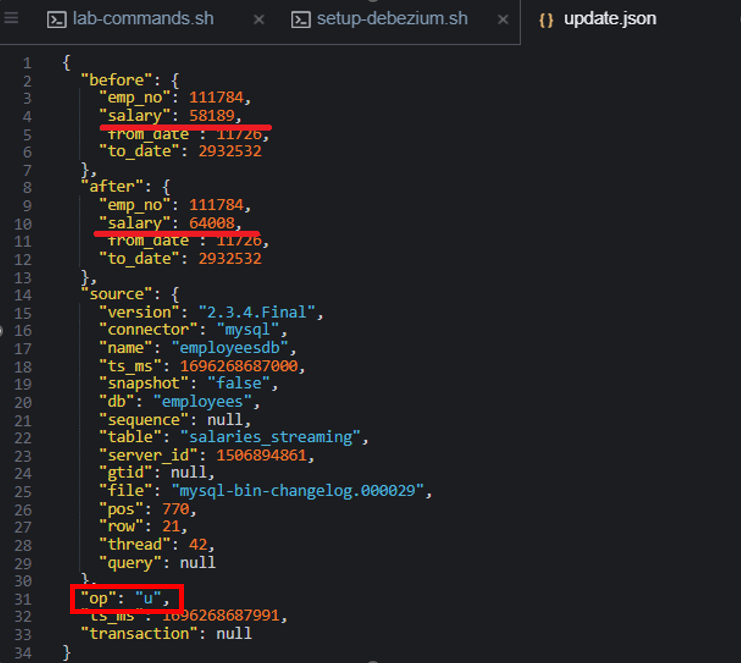

6)  Business is no longer strong and we will need to lay off some
    employees to cover the raises given to department managers. We
    unfortunately will be deleting some employees from the employees
    table and inspecting the delete events captured by Debezium and
    stored in S3.

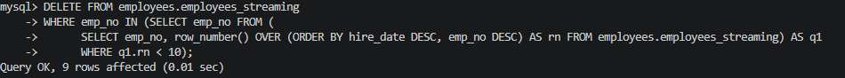

7)  Inspect the delete events propagated to S3:
    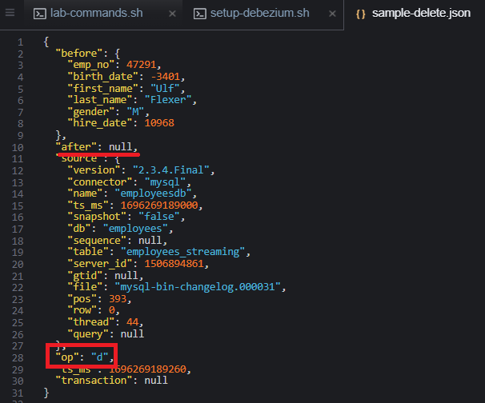

8)  Finally, we have a new data pipeline to set up. Let's inspect what
    happens when you deploy a new Debezium connector on existing tables.
    Note that you can exit the MySQL command line with the exit;
    command.

**New source connector:**

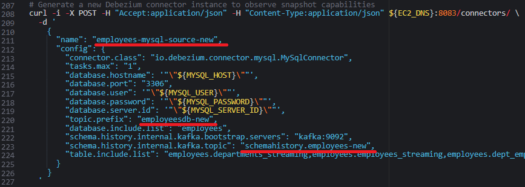

**New sink connector:**
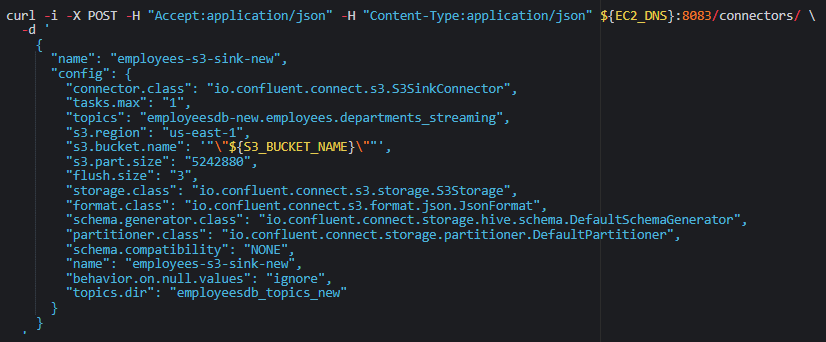

9)  Observe the new paths created in S3
    and note that all the new backend topics have been recreated for
    this new connector. Note that Debezium has propagated the current
    state of the tables in a snapshot read operation, leveraging an
    operation code of "r" (for read).

    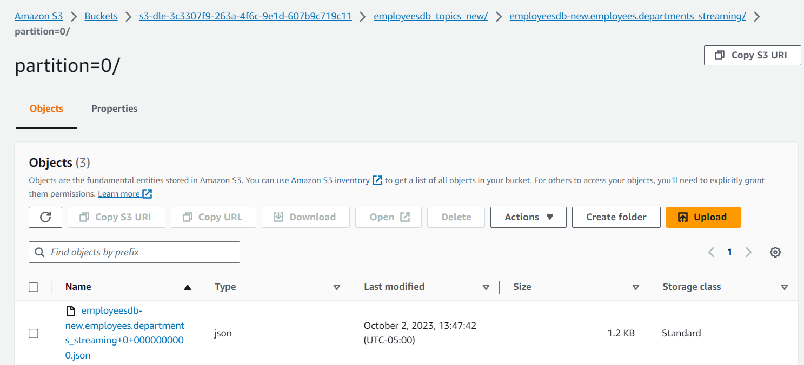

10) These are similar to create events but the "r" operation code
    indicates they have been created from an initial snapshot:

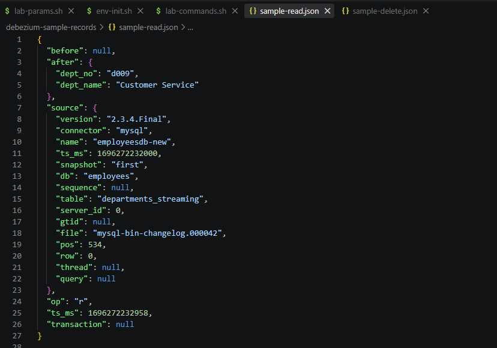

# Section 7: Remove lab resources

The env-destroy.sh script will clean up your lab resources including an:

- EC2 instance, associated keypair, and associated security group

- RDS instance, associated security group, and associated parameter
  group

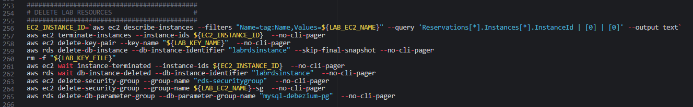

# Conclusion

In this lab, you were able to perform data collection from a cloud SQL
data source all the way to cloud storage leveraging a mature streaming
architecture. By combining Kafka topics with native Kafka Connect
capabilities and third-party Debezium and Confluent connectors, you were
able to build an architecturally elegant, low-code, resilient streaming
solution for your data lake. In later labs we will not only collect but
also prepare and analyze data streams in a data lake environment.
