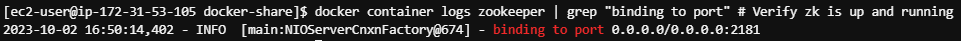
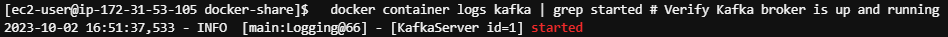
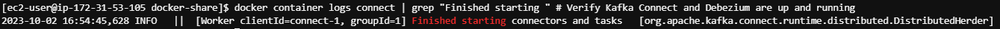

# Introduction

In this lab, we will be running Debezium on a remote EC2 instance to
capture changes from a MySQL instance hosted on Amazon Relational
Database Service (RDS). In addition, we will be streaming changes in
near real-time and storing them in S3. You will see streaming and cloud
storage services used in tandem to bring cloud data into a data lake.

We will continue to use Cloud9 to automate infrastructure deployment and
interact with cloud resources.

# Pre-requisites

You should have a Cloud9 environment up and running with necessary lab
files uploaded to your Cloud9 instance. Additionally, you should be
familiar with the infrastructure as code and lab conventions we have
used previously in class.

**[\]{.underline}**

# Section 1: Set environment variables and create an S3 bucket (or reuse an existing one)

1)  Once you have opened your Cloud9 environment and uploaded lab files,
    it should look like this:

{width="6.5in"
height="3.0854166666666667in"}

2)  First, open lab-commands.sh. You need to update the CLIENT_IP
    variable with your IP address shown at
    <https://checkip.amazonaws.com/>:

{width="5.283333333333333in"
height="2.111111111111111in"}

3)  {width="4.684722222222222in"
    height="3.95625in"}Next, copy and run the first section of code in
    your terminal in order to initialize lab parameters and configure
    the AWS command line interface (CLI). This section can be safely
    executed all at once.

4)  Now that you have configured the AWS CLI and set necessary lab
    variables, we can start deploying resources. The following section
    of code will either reuse an existing S3 bucket (if you have one) or
    create a new one (if you do not). Run it in your terminal:

{width="5.222222222222222in"
height="2.792361111111111in"}

5)  Double check that your bucket was created at
    <https://s3.console.aws.amazon.com/s3>:

{width="6.5in"
height="1.3993055555555556in"}

# Section 2: Deploy an Amazon EC2 Instance for hosting Debezium

1)  {width="4.972222222222222in"
    height="3.4166666666666665in"}In this section, we will deploy an EC2
    instance leveraging the AWS CLI. The first section determines the
    CIDR suffix to make your CLIENT_IP (or all Ips if you need to
    troubleshoot) a valid CIDR block and creates the keypair to
    associate with your EC2 instance:

2)  This next section creates the security group and initializes
    firewall rules for our EC2 instance. We are allowing Cloud9 access
    to ports 22 (SSH) and the Kafka Connect API (8083) for later in the
    lab. Additionally, your client IP will be able to access ports 8080
    (Debezium UI) and 9092 (Kafka).

{width="6.5in"
height="3.921527777777778in"}

3)  {width="6.861111111111111in"
    height="3.1840277777777777in"}Now that we have a security group and
    keypair configured, we are ready to start the instance.
    Additionally, run the rest of this section. Note that we query some
    instance details like the instance ID, public IP address (for
    accessing the instance from your PC), and local IP address (for
    accessing the instance from your Cloud9 environment or other
    resources hosted on AWS). Finally, the instance is associated with
    the 'LabInstanceProfile' and 'LabRole' created by Vocareum for lab
    usage. This allows the EC2 instance to access our secure S3 bucket.

4)  {width="7.5in"
    height="1.8722222222222222in"}Make sure the EC2 instance is running
    and review the configuration in the AWS console at
    <https://us-east-1.console.aws.amazon.com/ec2/>:

# Section 3: Create a cloud MySQL database hosted on RDS and initialize data, streaming tables

1)  In the first two sections, we made sure to deploy a cloud storage
    instance on S3 and a cloud virtual machine on EC2 for hosting
    streaming services. Next, we are going to deploy a SQL Database
    leveraging Amazon's PaaS Relational Database Service (RDS). For this
    lab we will be leveraging MySQL as the database provider and our
    data source.

2)  {width="7.5in"
    height="3.058333333333333in"}First, create a new security group
    specifically for secure database access. This will allow your Cloud9
    instance, streaming environment on EC2, and PC to access MySQL on
    port 3306:

3)  {width="6.102083333333334in"
    height="3.953472222222222in"}The Debezium MySQL connector is
    dependent on the binary log to capture changes. This section of code
    creates a database parameter group which overrides some of the MySQL
    defaults for compatibility with Debezium:

4)  Create the RDS instance, associating both the security group and
    parameter group with the new MySQL database:

{width="3.9722222222222223in"
height="4.953685476815398in"}

5)  {width="7.5in"
    height="1.71875in"}Open the RDS console and view your new database
    instance by clicking 'databases' at
    <https://us-east-1.console.aws.amazon.com/rds>:

6)  We are leveraging the MySQL employees database to populate sample
    data and explore streaming data collection. This database is
    documented here: <https://dev.mysql.com/doc/employee/en/>. The
    following section of code downloads the database initialization
    artifacts from Git. Note that when you use the MySQL command line
    interface, you are connecting from Cloud9 to your remote RDS
    instance hosted by Amazon.

**Important:** Watch out for the error below. Due to potential file
locking issues, you may need to rerun one or two lines if you get this
error related to accessing credentials:

Unable to parse config file: /home/ec2-user/.aws/credentials

{width="7.981944444444444in"
height="1.8055555555555556in"}**Database initialization:**

{width="5.314583333333333in"
height="2.00625in"}**Database output:**

{width="3.3796303587051617in"
height="2.6520866141732284in"}**Database tests:**

7)  Rather than stream directly from base tables, we want to avoid an
    overly large initial load (Debezium snapshot load) from these
    tables. Instead, we are creating empty copies of these tables and
    populating them with a subset of data to better manage load on our
    lab environment. We will insert, update, and delete records later in
    the lab once streaming services are up and running.

{width="7.979861111111111in"
height="1.6569444444444446in"}

8)  Validate tables leveraging the SHOW TABLES command:

{width="6.518518153980753in"
height="1.673086176727909in"}

# Section 4: Start Debezium services and load Confluent S3 sink connector

1)  For this section, we need to **open a new terminal session** in our
    Cloud9 environment. It is important to keep an SSH session open with
    both our Cloud9 environment and our streaming environment (hosted on
    the EC2 instance we created earlier). Open setup-debezium.sh and
    create a new terminal session to interact with the remote EC2
    instance and set up Debezium.

**Create a new terminal session:**

{width="7.5in" height="2.70625in"}

{width="8.257347987751531in"
height="1.5092596237970253in"}Run the following section of code to open
an SSH session with your running EC2 instance. Be sure to run these in
your second terminal window. Note that we are copying the Confluent S3
connector (zip file) so that we can install it on our Kafka Connect
instance later:

> **ASCII art welcomes you to the Amazon Linux instance:**

{width="6.854166666666667in"
height="2.2708333333333335in"}

**\**

2)  {width="7.5in"
    height="2.3847222222222224in"}You will be using docker to run
    different services on this machine: Zookeeper, Kafka (brokers),
    Kafka Connect with Debezium/Confluent connectors, and Debezium UI
    (currently expiremental). Run the following section of code to
    install and configure Docker and prepare the Confluent connector for
    installation on Kafka Connect:

3)  As discussed in class, Kafka may rely on Zookeeper for cluster
    configuration management and consumer-partition offsets. Zookeeper
    needs to be up and running before we start Kafka. Note that we are
    leveraging the Debezium docker image to run Zookeeper, Kafka,
    Connect, and Debezium services. Query the logs until you see the
    following output indicating that Zookeeper is up and ready to take
    requests.

> **Starting Zookeeper:**
>
> {width="6.805555555555555in"
> height="1.8595548993875766in"}

{width="7.5in" height="0.32013888888888886in"}
**Zookeeper running and ready to take requests:**

4)  Now that Zookeeper is up and running, we can start Kafka. Note the
    docker link, ensuring that the Kafka container can access services
    running on the Zookeeper container. The link feature may be
    deprecated in a future Docker release, but is still used by these
    Debezium containers.

{width="7.5in"
height="2.1659722222222224in"}**Starting Kafka:**

{width="7.5in"
height="0.29305555555555557in"}**Kafka running and ready to take
requests:**

5)  Similarly, we are now ready to start Kafka Connect. Note the volume
    mapping which places the extracted Confluent S3 sink connector in
    the plugins directory on Debezium, allowing us to integrate with S3.
    Additionally, there is a link to enable the dependency between Kafka
    Connect and Kafka.

> {width="7.5in"
> height="2.158333333333333in"}**Starting Kafka Connect:**
>
> {width="7.5in"
> height="0.22430555555555556in"}**Kafka Connect running and ready to
> take requests:**

6)  Finally, start Debezium UI. We will take a brief look at this
    service to validate our Debezium connector in the next section. Once
    you have started Debezium UI, you should switch back to your first
    terminal session in Cloud9.

**Starting Debezium UI:**

{width="5.770833333333333in"
height="2.09375in"}

# Section 5: Deploy and validate a MySQL source connector and an S3 sink connector on Kafka Connect

1)  {width="5.611805555555556in"
    height="3.25in"}In this section, we will be deploying connectors to
    Kafka Connect leveraging its REST API. Make sure you are back in
    your first Cloud9 terminal session for this section and open
    lab-commands.sh:

2)  Leverage curl to invoke the Kafka Connect REST API and create our
    source connector. Note that we are passing important database
    details including the host, user, and password. Additionally, we
    specify the databases and tables to include, as well as the location
    of our Kafka servers (among other configs).

**JSON request to create MySQL source connector:**

{width="7.5in"
height="2.352777777777778in"}

{width="7.804861111111111in"
height="1.1847222222222222in"}**API response:**

**\**

3)  Next, we'll start the sink connector to stream data from Kafka
    topics to AWS S3. Note that we are setting S3 details, the Confluent
    connector class, storage format for database events, topics for
    monitoring, the path to output in S3, and behavior for null values
    to capture delete events (among other configs).

{width="7.5in"
height="3.0597222222222222in"}**JSON request to create S3 sink
connector:**

{width="7.5in"
height="1.1291666666666667in"}**API response:**

4)  Find the Public IPv4 DNS for your streaming services here
    <https://us-east-1.console.aws.amazon.com/ec2>. Use it to open the
    Debezium UI on port 8080 and validate your MySQL connector.

{width="7.25in"
height="2.821527777777778in"}**Public IPv4 DNS in AWS:**

5)  Be sure to specify port 8080 when you open the Debezium UI, e.g.

{width="7.5in"
height="3.345138888888889in"}http://ec2-25-255-25-255.compute-1.amazonaws.com:8080.

6)  {width="8.022916666666667in"
    height="1.8145833333333334in"}The Debezium UI only shows the status
    of connectors and tasks for Debezium connectors at this time. We can
    leverage the API to check the status of both the MySQL source and S3
    sink connectors.

# Section 6: Validate create, update, delete, and read (snapshot) operations in MySQL and Debezium

1)  In this section, we will be performing create, update, and delete
    operations within our source database. If previous sections have
    been completed correctly, you should see events flowing from your
    SQL database all the way to your cloud storage in S3.

2)  {width="6.9215277777777775in"
    height="2.370138888888889in"}First, switch back to setup-debezium.sh
    and your second terminal for one step. Examine the topics that Kafka
    Connect has created within Kafka:

3)  {width="7.811111111111111in"
    height="2.9347222222222222in"}Switch back to your first terminal in
    Cloud9 and connect to your RDS instance using the MySQL command line
    interface. Input commands from sql-generate-sql-records.sql,
    starting with insert commands.

4)  Once all insert commands have completed, inspect the create events
    being stored in your S3 bucket at
    <https://s3.console.aws.amazon.com/s3>. Leverage the console to
    inspect, download, and view insert events. Note that the "before"
    state of the row is null for a create, while the "after" state will
    have the values for the new row. Inspect the other metadata
    associated with the new row including table name, database, log
    file, etc.

{width="7.5in"
height="3.3208333333333333in"}**Browsing your S3 bucket:**

{width="5.138888888888889in"
height="3.5409722222222224in"}**Viewing insert event details:**

5)  Next, generate some update events. Business is good and we are
    giving managers a raise, increasing their salary by 10%. Note that
    this is for demo purposes only and we will not be leveraging
    from_date or to_date, but doing in-place updates on the
    salaries_streaming table:

{width="4.795819116360455in"
height="3.5675371828521434in"}

6)  {width="5.493055555555555in"
    height="4.914583333333334in"} Inspect the update events being stored
    in S3, taking note of the before/after state of the row and salary
    increase:

7)  {width="7.5in"
    height="3.486111111111111in"}Business is no longer strong and we
    will need to lay off some employees to cover the raises given to
    department managers. We unfortunately will be deleting some
    employees from the employees table and inspecting the delete events
    captured by Debezium and stored in S3.

8)  {width="5.023611111111111in"
    height="4.177777777777778in"}Inspect the delete events propagated to
    S3:

9)  Finally, we have a new data pipeline to set up. Let's inspect what
    happens when you deploy a new Debezium connector on existing tables.
    Note that you can exit the MySQL command line with the exit;
    command.

{width="7.5in"
height="2.6819444444444445in"}**New source connector:**

{width="7.5in"
height="3.1055555555555556in"}**New sink connector:**

10) {width="6.033333333333333in"
    height="2.7430555555555554in"}Observe the new paths created in S3
    and note that all the new backend topics have been recreated for
    this new connector. Note that Debezium has propagated the current
    state of the tables in a snapshot read operation, leveraging an
    operation code of "r" (for read).

11) These are similar to create events but the "r" operation code
    indicates they have been created from an initial snapshot:

{width="6.645833333333333in"
height="4.625in"}

# Section 7: Remove lab resources

The final section of the lab removes the following resources:

- EC2 instance, associated keypair, and associated security group

- RDS instance, associated security group, and associated parameter
  group

{width="7.5in"
height="1.1645833333333333in"}

# Conclusion

In this lab, you were able to perform data collection from a cloud SQL
data source all the way to cloud storage leveraging a mature streaming
architecture. By combining Kafka topics with native Kafka Connect
capabilities and third-party Debezium and Confluent connectors, you were
able to build an architecturally elegant, low-code, resilient streaming
solution for your data lake. In later labs we will not only collect but
also prepare and analyze data streams in a data lake environment.
